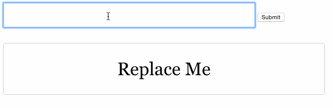

# Code Appetizer

1. Create a text input and a button
2. When the button is clicked, the text that is in the text input will be copied over to the div with id="foo"

## BONUS:

1. When the button is clicked, assign a new color to the background of the div with id="foo" Cycle among three colors

